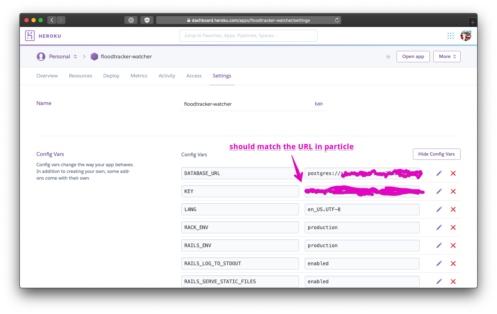
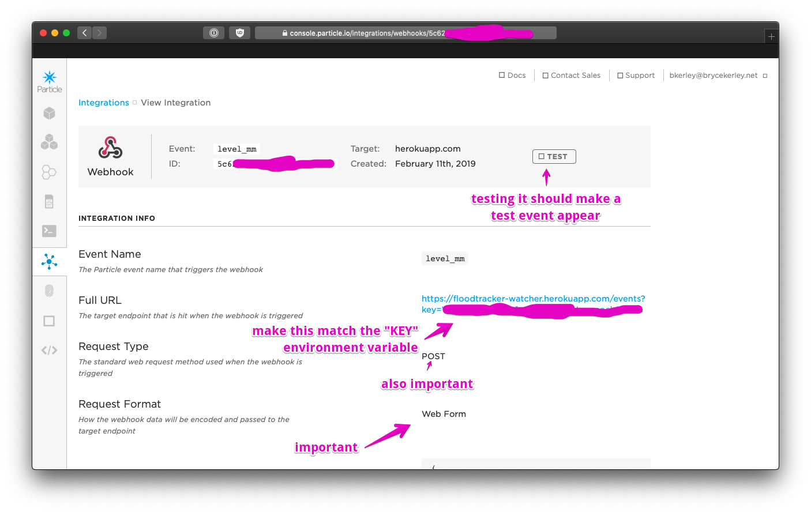

# floodtracker-watcher

This is a quick little app to store results from the Code for Miami
IoT Flood Tracker. This project uses the Particle microcontroller & cell
system to get data from deployed sensors, and puts it in a database. Don't
think of it as a destination, but as part of the journey.

I've found it really helpful while debugging sensor behavior.

It shows events: https://floodtracker-watcher.herokuapp.com/events

It shows other status updates: https://floodtracker-watcher.herokuapp.com/sparks

It "has" "UI" I guess!

## developing

it's a really standard rails app

### importing a backup

`pg_restore -d floodtracker-watcher_development tmp/b004.pgdump`

## deploying

it deploys just fine on heroku (by design)

set a "KEY" environment variable so that pushed data can be authenticated

once it's migrated and running and happy (the events & sparks URLs above should
work), set up the appropriate URLs in the particle web console

on particle, send `level_mm` events to
`https://floodtracker-watcher.herokuapp.com/events?key=YOUR KEY HERE`
and `spark` events to
`https://floodtracker-watcher.herokuapp.com/sparks?key=YOUR KEY HERE`

## questions

I learned a lot and had a lot of fun with this! If you've got questions,
email me at bkerley@brycekerley.net .
